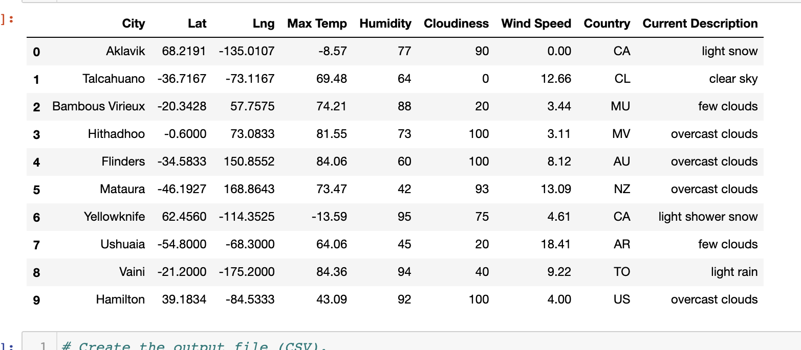
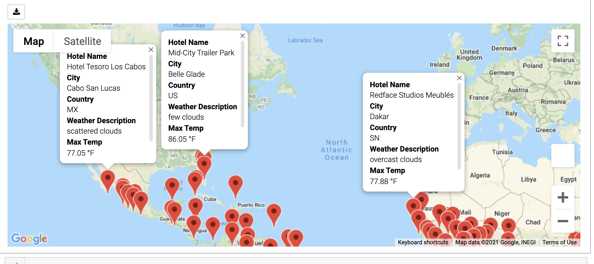
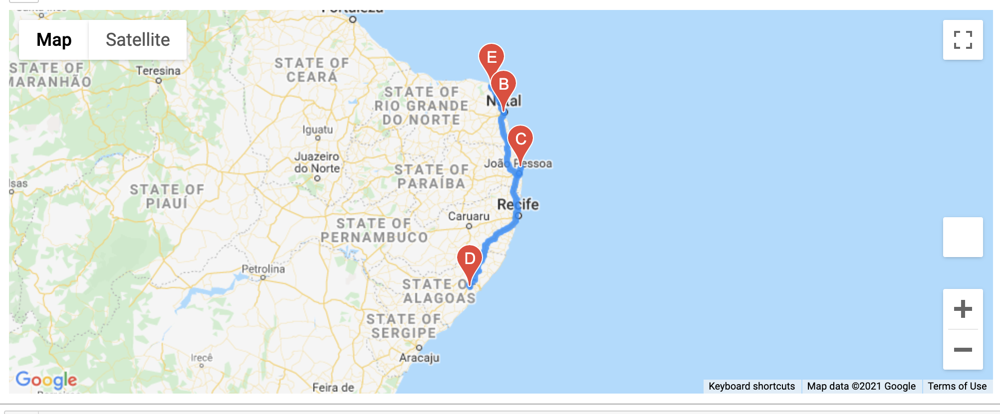
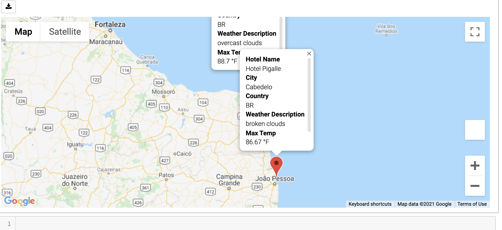

# World_Weather_Analysis

## Background

>A recommendation was made to add the weather description to the weather data retrieved in World_Weather_Analysis module. Then, use input statements to filter the data based on the Beta testers input for weather preferences, which will be used to identify potential travel destinations and nearby hotels. From the list of potential travel destinations, the beta tester will choose four cities to create a travel itinerary. Finally, using the Google Maps Directions API, I will create a travel route between the four cities as well as a marker layer map.

### Deliverable 1: Retrieve Weather Data
1. Generate a set of 2,000 random latitudes and longitudes.
2. Retrieve the nearest city, and perform an API call with the OpenWeatherMap.
3. Retrieve the current weather description for each city from the API call.
4. Create a new DataFrame containg the updated weather data.

### Deliverable 2: Create a Customer Travel Destinations Map
1. Use input statements to retrieve customer weather preferences.
2. Use customer weather preferences to identify potential travel destinations and nearby hotels.
3. Print those destinations on amrker layer map with pop-up markers.

* Additional help:*

* https://www.kite.com/python/answers/how-to-replace-each-empty-string-in-a-pandas-dataframe-with-nan-in-python#:~:text=Call%20pandas.,containing%20only%20spaces%20with%20NaN%20.

### Deliverable 3: Create a Travel Itinerary Map
1. Use the Google Directions API to create a travel itinerary that shows the route between four cities chosen from the customer’s possible travel destinations.
2. Create a marker layer map with a pop-up marker for each city on the itinerary.

